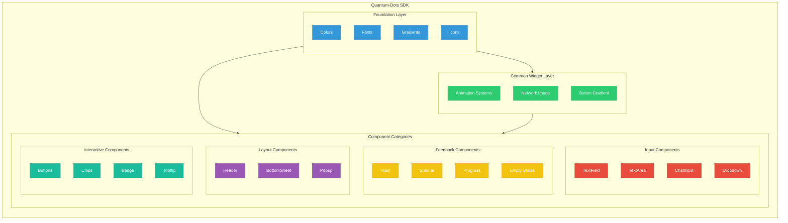

# Quantum-Dots
This design system is designed for use on the Flutter platform and is based on the design of the Wippy Global Product.

# Architecture

```mermaid
flowchart TB
    subgraph SDK["Quantum-Dots SDK"]
        direction TB
        
        subgraph Foundation["Foundation Layer"]
            direction TB
            Colors["Colors"]:::foundation
            Fonts["Fonts"]:::foundation
            Gradients["Gradients"]:::foundation
            Icons["Icons"]:::foundation
        end

        subgraph Common["Common Widget Layer"]
            direction TB
            Animation["Animation Systems"]:::common
            NetworkImage["Network Image"]:::common
            ButtonGradient["Button Gradient"]:::common
        end

        subgraph Components["Component Categories"]
            direction TB
            
            subgraph Input["Input Components"]
                direction TB
                TextField["TextField"]:::input
                TextArea["TextArea"]:::input
                ChatInput["ChatInput"]:::input
                Dropdown["Dropdown"]:::input
            end

            subgraph Feedback["Feedback Components"]
                direction TB
                Toast["Toast"]:::feedback
                Spinner["Spinner"]:::feedback
                Progress["Progress"]:::feedback
                EmptyStates["Empty States"]:::feedback
            end

            subgraph Layout["Layout Components"]
                direction TB
                Header["Header"]:::layout
                BottomSheet["BottomSheet"]:::layout
                Popup["Popup"]:::layout
            end

            subgraph Interactive["Interactive Components"]
                direction TB
                Buttons["Buttons"]:::interactive
                Chips["Chips"]:::interactive
                Badge["Badge"]:::interactive
                Tooltip["Tooltip"]:::interactive
            end
        end
    end

    %% Relationships
    Foundation --> Common
    Foundation --> Components
    Common --> Components

    %% Click Events
    click Colors "https://github.com/nrise/Quantum-Dots/blob/develop/lib/src/foundation/color.dart"
    click Fonts "https://github.com/nrise/Quantum-Dots/blob/develop/lib/src/foundation/font.dart"
    click Gradients "https://github.com/nrise/Quantum-Dots/blob/develop/lib/src/foundation/gradient.dart"
    click Icons "https://github.com/nrise/Quantum-Dots/blob/develop/lib/src/foundation/icon_path.dart"
    click Animation "https://github.com/nrise/Quantum-Dots/tree/develop/lib/src/common_widget/animation/"
    click NetworkImage "https://github.com/nrise/Quantum-Dots/blob/develop/lib/src/common_widget/wippy_network_image.dart"
    click ButtonGradient "https://github.com/nrise/Quantum-Dots/blob/develop/lib/src/common_widget/button_gradient.dart"
    click TextField "https://github.com/nrise/Quantum-Dots/blob/develop/lib/src/input/textfield/wippy_text_field.dart"
    click TextArea "https://github.com/nrise/Quantum-Dots/blob/develop/lib/src/input/textarea/wippy_text_area.dart"
    click ChatInput "https://github.com/nrise/Quantum-Dots/blob/develop/lib/src/input/chat_input/chat_input.dart"
    click Dropdown "https://github.com/nrise/Quantum-Dots/blob/develop/lib/src/input/dropdown/wippy_drop_down.dart"
    click Toast "https://github.com/nrise/Quantum-Dots/blob/develop/lib/src/toast/wippy_toast.dart"
    click Spinner "https://github.com/nrise/Quantum-Dots/blob/develop/lib/src/spinner/wippy_spinner.dart"
    click Progress "https://github.com/nrise/Quantum-Dots/blob/develop/lib/src/progress/wippy_progress_bar.dart"
    click EmptyStates "https://github.com/nrise/Quantum-Dots/blob/develop/lib/src/empty_states/wippy_empty_states.dart"
    click Header "https://github.com/nrise/Quantum-Dots/blob/develop/lib/src/header/wippy_header.dart"
    click BottomSheet "https://github.com/nrise/Quantum-Dots/blob/develop/lib/src/bottom_sheet/composable/wippy_bottom_sheet.dart"
    click Popup "https://github.com/nrise/Quantum-Dots/blob/develop/lib/src/popup/wippy_popup.dart"
    click Buttons "https://github.com/nrise/Quantum-Dots/blob/develop/lib/src/button/wippy_box_button.dart"
    click Chips "https://github.com/nrise/Quantum-Dots/blob/develop/lib/src/chips/chips/wippy_multi_selective_chips.dart"
    click Badge "https://github.com/nrise/Quantum-Dots/blob/develop/lib/src/badge/wippy_badge.dart"
    click Tooltip "https://github.com/nrise/Quantum-Dots/blob/develop/lib/src/tooltip/tooltip_component.dart"

    %% Styling
    classDef foundation fill:#3498db,stroke:#2980b9,color:white
    classDef common fill:#2ecc71,stroke:#27ae60,color:white
    classDef input fill:#e74c3c,stroke:#c0392b,color:white
    classDef feedback fill:#f1c40f,stroke:#f39c12,color:white
    classDef layout fill:#9b59b6,stroke:#8e44ad,color:white
    classDef interactive fill:#1abc9c,stroke:#16a085,color:white
```
